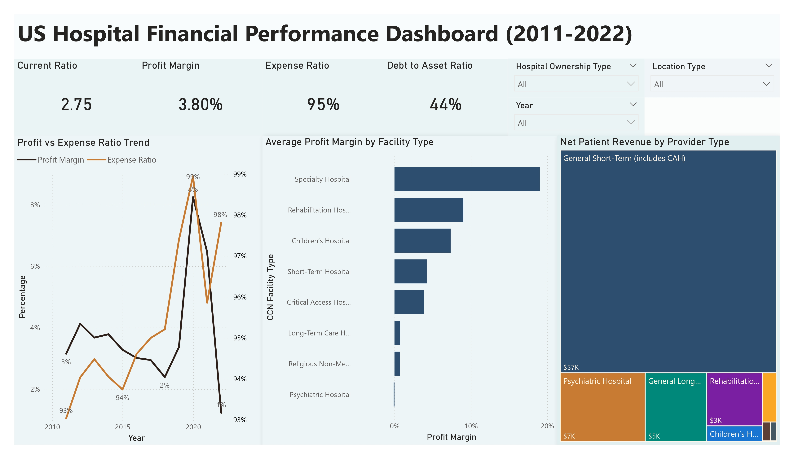
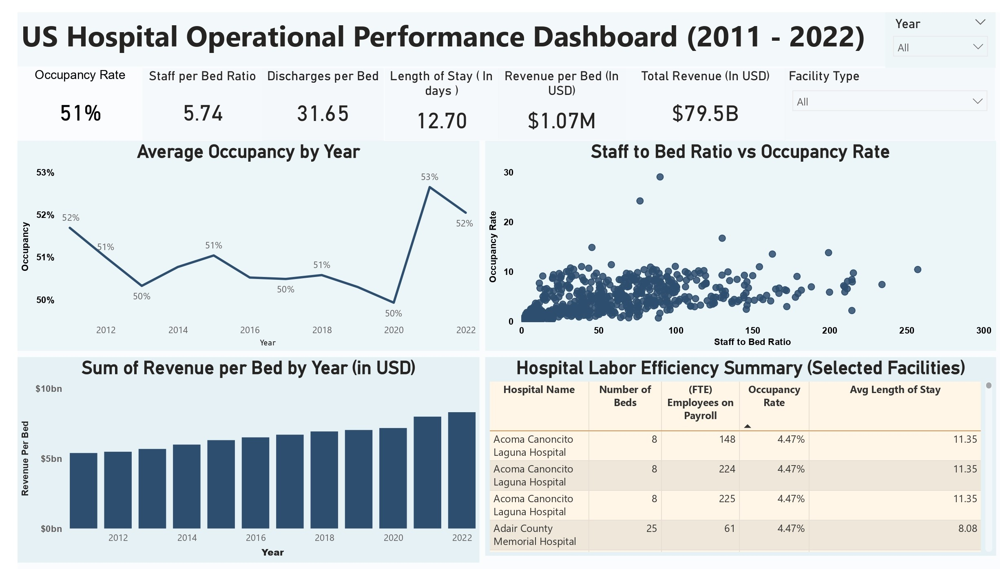
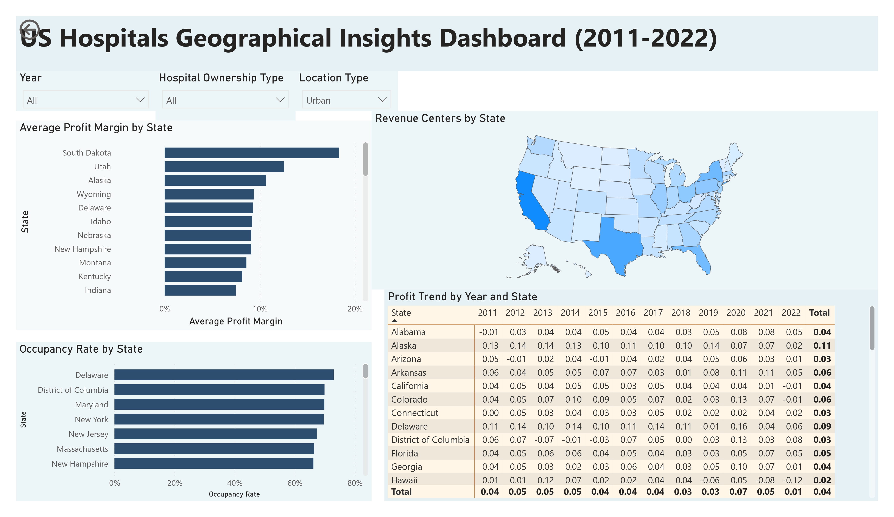

# **Financial & Operational Analysis of U.S. Hospitals**

### **CMS Hospital Provider Cost Reports (2011–2022)**


---

# **Table of Contents**

* [Project Overview](#project-overview)
* [Executive Summary](#executive-summary)
* [Key Insights](#key-insights)
* [Repository Structure](#repository-structure)
* [Workflow Summary](#workflow-summary)
* [Key Performance Indicators (KPIs)](#key-performance-indicators-kpis)
* [Power BI Dashboards](#power-bi-dashboards)
* [Dashboard Preview](#dashboard-preview)
* [Tools and Technologies](#tools-and-technologies)
* [How to Run the Project](#how-to-run-the-project)
* [Future Enhancements](#future-enhancements)
* [Team Members](#team-members)
* [References](#references)

---

# **Project Overview**

This capstone project analyzes 12 years of CMS Hospital Provider Cost Reports (2011–2022) to understand:

* Hospital financial performance
* Operational efficiency
* Geographic variations
* Post-COVID operational shifts

Project deliverables include:

* Consolidation of CMS datasets
* Multi-level data cleaning
* Exploratory Data Analysis (EDA)
* KPI engineering
* Preliminary and final Power BI dashboards
* Project documentation (Business Case, Charter, Presentation, Minutes)

This project is part of the Data Analytics for Business program (Group 8).

---

# **Executive Summary**

Hospitals across the U.S. face operational and financial challenges.
This project evaluates key indicators to help stakeholders understand:

* Profitability trends
* Bed utilization efficiency
* Staffing impact on operations
* State-level variations in hospital performance

The dashboards and KPIs provide actionable insights for decision-making.

---

# **Key Insights**

* For-profit hospitals demonstrate higher profit margins
* Non-profit hospitals process larger patient volumes
* Strong variation across states in revenue and expenses
* Occupancy rates declined in multiple states post-COVID
* Staffing shortages correlate with discharge and stay duration issues

---

# **Repository Structure**

```
hospital-provider-cost-analysis/
│
├── data_collection/
│   ├── cms_raw/
│   ├── combined/
│   └── data_collection.ipynb
│
├── data_processing/
│   ├── cleaned/
│   └── data_cleaning.ipynb
│
├── eda/
│   ├── kpi_ready/
│   └── eda.ipynb
│
├── documents/
│   ├── Business_Case.pdf
│   ├── Capstone_Group_8.pptx
│   ├── Meeting_Minutes_Part_1.pdf
│   ├── Meeting_Minutes_Part_2.pdf
│   ├── Meeting_Minutes_Part_3.pdf
│   ├── Meeting_Minutes_Part_4.pdf
│   ├── Meeting_Minutes_Part_5.pdf
│   ├── Summarized_Meeting_Minutes.pdf
│   ├── Preliminary_Research_Document.pdf
│   └── Project_Charter.pdf
│
├── powerbi/
│   ├── Preliminary_Dashboard_Group_8.pbix
│   ├── Final_Dashboard_Group_8.pbix
│   └── images/
│       ├── financial_view.jpg
│       ├── operational_view.jpg
│       └── geographic_view.jpg
│
├── README.md
└── requirements.txt
```

---

# **Workflow Summary**

## 1. Data Collection

Notebook: `data_collection/data_collection.ipynb`

* Loaded annual CMS files
* Standardized variables
* Merged datasets into master file
* Output saved to `data_collection/combined/`

---

## 2. Data Cleaning

Notebook: `data_processing/data_cleaning.ipynb`

* Missing value treatment
* Duplicate removal
* Categorization cleanup
* Financial integrity validation
* Output saved to `data_processing/cleaned/`

---

## 3. Exploratory Data Analysis (EDA)

Notebook: `eda/eda.ipynb`

* Further cleaning
* KPI feature engineering
* Outlier handling
* Ownership, facility, and geographic insights
* Output saved to `eda/kpi_ready/`

---

# **Key Performance Indicators (KPIs)**

## Financial KPIs

* Profit Margin
* Expense Ratio
* Current Ratio
* Debt-to-Asset Ratio
* Revenue per Bed

## Operational KPIs

* Occupancy Rate
* Staff-to-Bed Ratio
* Discharges per Bed
* Average Length of Stay

---

# **Power BI Dashboards**

## Final Dashboard

`powerbi/Final_Dashboard_Group_8.pbix`
Includes:

* Financial performance
* Operational efficiency trends
* Geographic mapping
* Drill-down hospital analytics

---

## Preliminary Dashboard

`powerbi/Preliminary_Dashboard_Group_8.pbix`
Designed for initial concept review and iteration.

---

# **Dashboard Preview**

### Financial Overview



### Operational Overview



### Geographic Analysis



---

# **Tools and Technologies**

* Python 3.13
* pandas, numpy, matplotlib, seaborn
* Jupyter Notebook
* Power BI Desktop
* Git & GitHub

---

# **How to Run the Project**

## Step 1 — Clone repository

```
git clone https://github.com/muthinenimanjunath/hospital-provider-cost-analysis.git
cd hospital-provider-cost-analysis
```

## Step 2 — Install dependencies

```
pip install -r requirements.txt
```

## Step 3 — Execute notebooks

1. `data_collection.ipynb`
2. `data_cleaning.ipynb`
3. `eda.ipynb`

## Step 4 — Open dashboards

```
powerbi/Final_Dashboard_Group_8.pbix
```

---

# **Future Enhancements**

* Predictive modeling for profitability
* Clustering-based hospital segmentation
* Automated ETL pipeline for CMS yearly updates
* Deployment through Power BI Service
* Time-series forecasting

---

# **Team Members (Group 8)**

* Manjunath Muthineni – Team Lead & Data Integration
* Abhishekh Choudhary – Data Cleaning Lead
* Krishna Chaitanya Venuturumilli – Visualization Lead
* Neha Oberoi – Research & Methodology Lead
* Rajesh Thota – Documentation Lead

---

# **References**

* CMS Hospital Provider Cost Report Data
  [https://data.cms.gov/provider-compliance/cost-report/hospital-provider-cost-report](https://data.cms.gov/provider-compliance/cost-report/hospital-provider-cost-report)

* Hospital Provider Cost Report Dataset (Data.gov)
  [https://catalog.data.gov/dataset/hospital-provider-cost-report-7c92c](https://catalog.data.gov/dataset/hospital-provider-cost-report-7c92c)

* Microsoft Power BI Documentation
  [https://learn.microsoft.com/en-us/power-bi/](https://learn.microsoft.com/en-us/power-bi/)